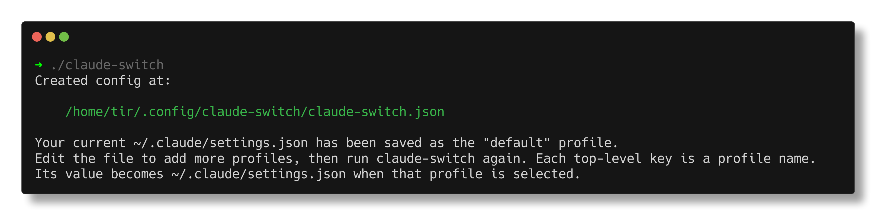
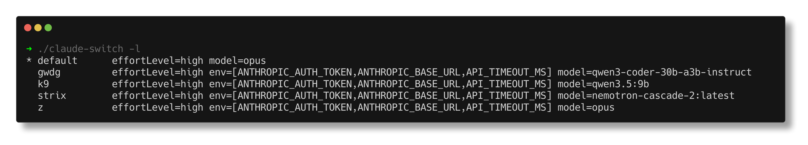

# Claude Switch

Switch between claude code backends, e.g.

* Anthropic (default)
* Compatible local API providers, e.g. via ollama, llama-cpp, lemonade, ...
* Other services, e.g. z.ai, ...

This program just keeps options in a config file and lets the user choose
between them interactively. This is a global option, not a per project option.

```
$ go install -v github.com/miku/claude-switch@latest
```

On first run, an example configuration file is created.



You can add additional providers and models into that file, then use
claude-switch to list or select between them.



To select interactively, just run:

```
$ claude-switch
```

## Example Config

An example config file for claude-switch:

```json
$ cat /home/tir/.config/claude-switch/claude-switch.json
{
  "default": {
    "effortLevel": "high",
    "model": "opus"
  },
  "z": {
    "env": {
      "ANTHROPIC_AUTH_TOKEN": "your_zai_api_key",
      "ANTHROPIC_BASE_URL": "https://api.z.ai/api/anthropic",
      "API_TIMEOUT_MS": "3000000"
    }
  }
}
```

## Inspiration

* [clother](https://github.com/jolehuit/clother), but I wanted something simpler to start with
* [claude-code-switch](https://github.com/foreveryh/claude-code-switch)
* ...
