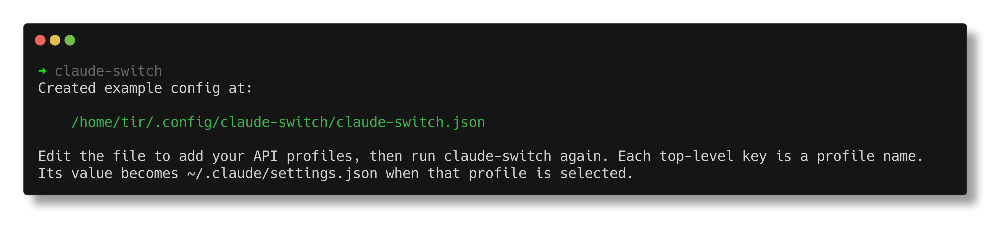
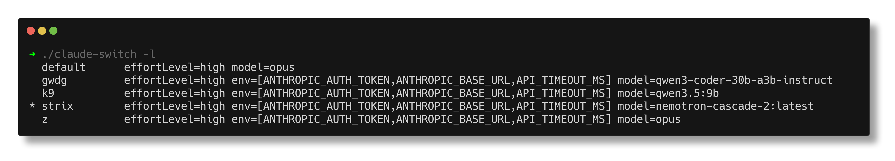

# Claude Switch

Switch between claude code backends, e.g.

* Anthropic (default)
* Compatible API, e.g. via ollama, llama-cpp, lemonade, ...
* Other providers, e.g. z.ai, ...

This program just keeps options in a config file and lets the user choose
between one interactively.

```
$ go install -v github.com/miku/claude-switch@latest
```

On first run, an example configuration file is created.



You can add additional providers and models into that file, then use
claude-switch to list or select between them.



To select interactively, just run:

```
$ claude-switch
```

## Inspiration

* [clother](https://github.com/jolehuit/clother), but I wanted something simpler to start with
